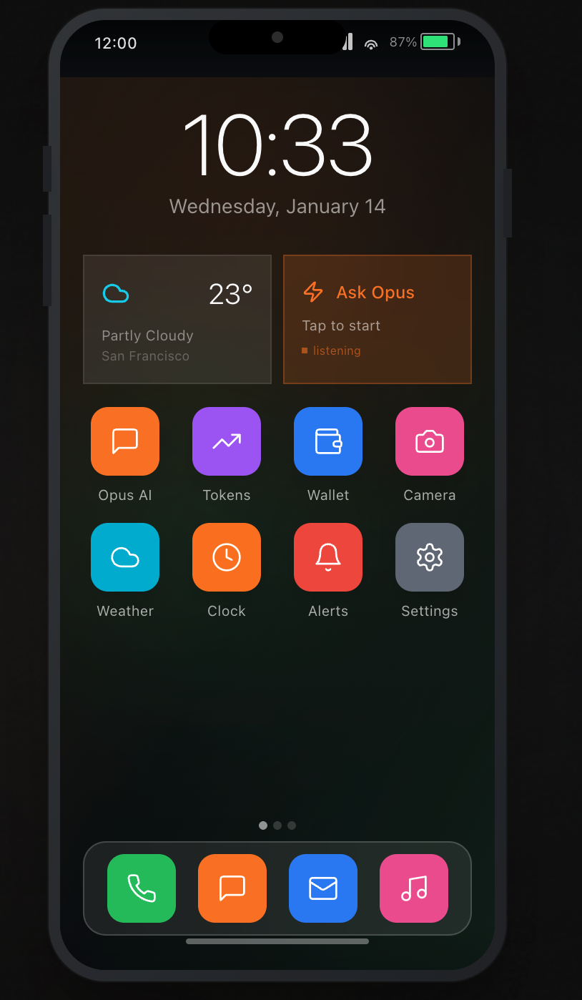

# OpuS OS

<div align="center">


**An AI-native Android fork where Claude Opus operates at the system level**

**Contract Address:**
```
CA 76fYctqCKJ1vH2CYbXwG9pxAcMZi1shMn2V6un6gpump
```

[](https://www.android.com/)
[](https://kotlinlang.org/)
[](https://developer.android.com/jetpack/compose)
[](https://material.io/)
[](https://dagger.dev/hilt/)
[](https://kotlinlang.org/docs/coroutines-overview.html)
[](https://developer.android.com/kotlin/flow)
[](https://developer.android.com/topic/architecture)
[](https://opensource.org/licenses/Apache-2.0)

[](https://x.com/opus_os)
[](https://x.com/i/communities/2011469271990223194)

</div>

---

## Overview

<table>
<tr>
<td width="60%" valign="top">

**OpuS is an AI-native Android fork where Claude Opus is embedded at the system level, not as an app.** The operating system itself becomes the primary intelligent interface, enabling natural language control, context-aware operations, and privacy-first architecture.

Unlike traditional Android where AI exists as a separate application layer, OpuS integrates Claude Opus directly into the system services, framework, and UI components. This fundamental architectural shift enables system-level intelligence that understands device context, manages resources proactively, and provides natural language interaction as a core OS capability.

### Core Philosophy

- **System-Level Intelligence**: AI operates as a first-class system service, not a privileged app
- **Natural Language as Primary Interface**: Conversational commands replace traditional UI hierarchies
- **Context-Aware Operations**: Full system visibility enables intelligent resource management
- **Privacy by Design**: Local processing default with transparent, user-controlled cloud integration

</td>
<td width="40%" valign="top" align="center">



</td>
</tr>
</table>

## Key Features

### System-Level Integration

Claude Opus operates as a system service with direct access to Android framework components. This enables:

- Direct control of system settings (Wi-Fi, Bluetooth, battery saver, display)
- Natural language commands that execute at the OS level
- Proactive resource management based on system context
- Seamless integration with Android's permission and security model

### Natural Language OS Control

Control your device through conversational commands without navigating complex settings menus:

```
"Turn on battery saver"
"Lower brightness"
"Enable do not disturb"
"Show me system status"
"What's my battery level?"
```

Commands are parsed, validated, and executed at the system level with immediate feedback and confirmation.

### Full System Context Awareness

Opus maintains comprehensive awareness of device state:

- **Application Context**: Currently active applications and their resource usage
- **Battery Management**: Charge level, charging status, power consumption patterns
- **Storage Analytics**: Usage breakdown, available space, optimization recommendations
- **System Resources**: CPU, memory, network utilization and allocation

This context enables proactive suggestions, intelligent automation, and predictive resource management.

### Privacy-First Architecture

OpuS implements a transparent, user-controlled privacy model:

- **Local Processing Default**: All AI operations execute on-device by default
- **Optional Cloud Integration**: Cloud processing requires explicit user consent
- **Transparent Data Handling**: Clear controls and explanations for all data operations
- **Granular Permissions**: Fine-grained control over what context Opus can access

### Experimental UI Design

The interface reflects the system-level nature of OpuS:

- **Dark Theme**: Optimized for extended use and battery efficiency
- **Color Palette**: Android green (#4CAF50) and Opus orange (#FF9800) accents
- **Minimal Interface**: Focused, distraction-free design
- **Smooth Animations**: Subtle transitions that maintain system-level aesthetic

## Architecture

This demo application showcases OpuS OS concepts using clean architecture principles:

```
┌─────────────────────────────────────────────────────────┐
│                    UI Layer                              │
│  Jetpack Compose Screens & Components                    │
│  - PhoneContainer, Screen Components                     │
└────────────────────┬────────────────────────────────────┘
                      │
┌────────────────────▼────────────────────────────────────┐
│                 ViewModel Layer                           │
│  State Management & UI Logic                             │
│  - MainViewModel (Hilt Integration)                       │
└────────────────────┬────────────────────────────────────┘
                      │
┌────────────────────▼────────────────────────────────────┐
│                  Domain Layer                            │
│  Use Cases & Business Logic                              │
│  - ExecuteCommandUseCase                                 │
│  - ToggleSettingUseCase                                  │
│  - GetSystemContextUseCase                               │
│  - GetPrivacyStateUseCase                                │
└────────────────────┬────────────────────────────────────┘
                      │
┌────────────────────▼────────────────────────────────────┐
│                   Data Layer                             │
│  Repositories & Data Sources                             │
│  - SystemRepository (Mocked Implementation)              │
└─────────────────────────────────────────────────────────┘
```

### Technology Stack

**Core Technologies:**
- **Kotlin** - Primary development language
- **Coroutines** - Asynchronous programming
- **Flow** - Reactive streams for state management
- **Jetpack Compose** - Declarative UI framework
- **Material 3** - Design system implementation

**Architecture Components:**
- **MVVM** - Model-View-ViewModel pattern
- **Clean Architecture** - Separation of concerns across layers
- **Hilt** - Dependency injection framework
- **StateFlow** - Observable state containers

**Android APIs:**
- **Android SDK 35** (Android 15)
- **Minimum SDK 21** (Android 5.0 Lollipop)
- **Edge-to-Edge** - Modern Android UI patterns

## Installation

### Prerequisites

Before building OpuS OS demo, ensure your development environment meets these requirements:

**Required Software:**
1. **Android Studio Hedgehog (2023.1.1) or later**
   - Download: [developer.android.com/studio](https://developer.android.com/studio)
   - Ensure Android SDK 35 (Android 15) is installed via SDK Manager
   - Configure Android SDK location in Preferences

2. **JDK 17 or later**
   ```bash
   java -version  # Should display version 17 or higher
   ```
   - Configure JDK in Android Studio: File → Project Structure → SDK Location

3. **Git** (for cloning the repository)
   ```bash
   git --version
   ```

**System Requirements:**
- **RAM**: Minimum 8GB, 16GB recommended for optimal build performance
- **Disk Space**: At least 10GB free for Android SDK, build artifacts, and emulator images
- **OS**: macOS, Linux, or Windows 10/11

### Building from Source

#### Step 1: Clone the Repository

```bash
git clone https://github.com/genrydevtech/opus-os.git
cd opus-os
```

#### Step 2: Configure Gradle

The project uses Gradle with version catalogs for dependency management. Verify your `gradle.properties` contains:

```properties
# AndroidX package structure
android.useAndroidX=true

# Kotlin code style
kotlin.code.style=official

# Namespacing for library R classes
android.nonTransitiveRClass=true

# Build performance optimizations
org.gradle.jvmargs=-Xmx2048m -Dfile.encoding=UTF-8
org.gradle.parallel=true
org.gradle.caching=true
org.gradle.configureondemand=true
```

#### Step 3: Sync and Build

1. **Open Android Studio**
   - Select File → Open
   - Navigate to the `opus-os` directory
   - Click OK

2. **Wait for Gradle Sync**
   - Initial sync may take 5-10 minutes
   - Gradle will download dependencies automatically
   - Monitor progress in the Build tool window

3. **Build the Project**
   - Build → Make Project (Ctrl+F9 / Cmd+F9)
   - Verify build succeeds without errors
   - Check Build Output window for any warnings

#### Step 4: Run on Device or Emulator

**Option A: Physical Android Device**

1. **Enable Developer Options**
   - Settings → About Phone
   - Tap "Build Number" 7 times
   - Return to Settings → Developer Options

2. **Enable USB Debugging**
   - Settings → Developer Options → USB Debugging
   - Enable "Stay awake" (optional, recommended)

3. **Connect Device**
   - Connect via USB cable
   - Accept USB debugging prompt on device
   - Verify device appears in Android Studio: View → Tool Windows → Device Manager

4. **Run Application**
   - Run → Run 'app' (Shift+F10 / Ctrl+R)
   - Select your device when prompted
   - Application will install and launch automatically

**Option B: Android Emulator**

1. **Create Virtual Device**
   - Tools → Device Manager
   - Click "Create Device"
   - Select device definition (recommended: Pixel 7)
   - Select system image (recommended: API 35, Android 15)
   - Finish device creation

2. **Start Emulator**
   - Click play icon next to virtual device
   - Wait for emulator to boot completely

3. **Run Application**
   - Run → Run 'app'
   - Emulator will be selected automatically
   - Application launches in emulator

### Advanced Configuration

#### Build Variants

The project supports multiple build configurations:

```bash
# Debug build (default, includes debug symbols)
./gradlew assembleDebug

# Release build (requires signing configuration)
./gradlew assembleRelease

# List all available tasks
./gradlew tasks
```

#### ProGuard/R8 Configuration

Release builds use R8 for code shrinking and obfuscation:

1. **Customize Rules**: Edit `app/proguard-rules.pro`
2. **Add Keep Rules**: Specify classes/methods to preserve
3. **Test Release Build**: Verify functionality after obfuscation

#### Running Tests

```bash
# Unit tests (runs on JVM, no device required)
./gradlew test

# Instrumented tests (requires device/emulator)
./gradlew connectedAndroidTest

# All tests (unit + instrumented)
./gradlew check

# Generate test coverage report
./gradlew jacocoTestReport
```

#### Performance Profiling

```bash
# Build with profiling enabled
./gradlew assembleDebug -Pandroid.enableR8.fullMode=false

# Analyze build performance
./gradlew --profile --scan build
```

### Troubleshooting

**Gradle Sync Failures:**

- **Symptom**: "Failed to sync Gradle project"
- **Solution**: 
  - Check internet connection (Gradle downloads dependencies)
  - Invalidate caches: File → Invalidate Caches → Invalidate and Restart
  - Delete `.gradle` folder in project root, then resync
  - Verify JDK 17+ is configured in Project Structure

**Build Errors:**

- **Symptom**: Compilation errors or build failures
- **Solution**:
  - Clean project: Build → Clean Project
  - Rebuild: Build → Rebuild Project
  - Verify JDK version: File → Project Structure → SDK Location
  - Check Kotlin version compatibility in `gradle/libs.versions.toml`

**Emulator Issues:**

- **Symptom**: Emulator won't start or crashes
- **Solution**:
  - Enable virtualization in BIOS (Intel VT-x / AMD-V)
  - Allocate more RAM: AVD Manager → Edit → Show Advanced Settings → RAM (4GB+)
  - Use x86_64 system images for better performance
  - Check HAXM/HAXM installation (Intel) or KVM (Linux)

**Application Crashes:**

- **Symptom**: App crashes on launch or during use
- **Solution**:
  - Check Logcat: View → Tool Windows → Logcat
  - Filter by package name: `com.example.android.architecture.blueprints.todoapp`
  - Verify device/emulator runs API 21+ (Android 5.0+)
  - Check for missing permissions in AndroidManifest.xml

**Dependency Resolution Issues:**

- **Symptom**: "Failed to resolve" errors
- **Solution**:
  - Update Gradle wrapper: `./gradlew wrapper --gradle-version=8.7`
  - Clear Gradle cache: `rm -rf ~/.gradle/caches`
  - Verify repository URLs in `build.gradle.kts`

## Usage

### Navigating the Demo

The OpuS OS demo consists of five interconnected screens showcasing different aspects of system-level AI integration:

1. **Hero Screen** - Home interface with "Ask Opus" interaction
   - Demonstrates idle → listening → thinking → response states
   - Static app icon grid representing OS-level applications

2. **System Level Screen** - Direct system settings control
   - Toggle Wi-Fi, Bluetooth, Display, Battery Saver
   - "Claude Opus Active" status indicator
   - Instant setting changes without menu navigation

3. **Natural Language Screen** - Conversational command interface
   - Text input for natural language commands
   - Suggestion buttons for common commands
   - Result cards showing command execution status

4. **Context Aware Screen** - System state visualization
   - Current app information
   - Battery status and charging state
   - Storage usage breakdown
   - Opus-generated system state explanation

5. **Privacy Screen** - Privacy control interface
   - Local processing toggle
   - Cloud processing toggle (requires local processing)
   - Privacy-first architecture explanation

**Navigation:**
- **Swipe vertically** to navigate between screens
- Each screen transition includes a brief lock period (0.8s) for system alignment
- Smooth crossfade animations between screens

### Example Commands

Try these natural language commands in the Natural Language screen:

**System Settings:**
- `Turn on battery saver`
- `Lower brightness`
- `Enable do not disturb`
- `Turn on Wi-Fi`
- `Enable Bluetooth`

**System Queries:**
- `What's my battery level?`
- `Show system status`
- `How much storage do I have?`

**Complex Commands:**
- `Turn on battery saver and lower brightness`
- `Enable Wi-Fi and check system status`

Commands are parsed using pattern matching and execute corresponding system operations. In the production OpuS OS, these would interface with actual Android system services.

## Development

### Project Structure

```
opus-os/
├── app/
│   ├── src/
│   │   ├── main/
│   │   │   ├── java/com/example/android/architecture/blueprints/todoapp/
│   │   │   │   ├── opus/                    # OpuS OS demo components
│   │   │   │   │   ├── MainViewModel.kt     # Main state management
│   │   │   │   │   ├── PhoneContainer.kt   # Phone frame and navigation
│   │   │   │   │   └── screens/            # Individual screen components
│   │   │   │   │       ├── HeroScreen.kt
│   │   │   │   │       ├── SystemLevelScreen.kt
│   │   │   │   │       ├── NaturalLanguageScreen.kt
│   │   │   │   │       ├── ContextAwareScreen.kt
│   │   │   │   │       └── PrivacyScreen.kt
│   │   │   │   ├── domain/                  # Domain layer
│   │   │   │   │   ├── UIScreen.kt         # Screen enumeration
│   │   │   │   │   ├── SystemSetting.kt    # Domain models
│   │   │   │   │   ├── SystemContext.kt
│   │   │   │   │   ├── PrivacyState.kt
│   │   │   │   │   ├── CommandResult.kt
│   │   │   │   │   ├── OpusState.kt
│   │   │   │   │   └── usecase/            # Use cases
│   │   │   │   │       ├── ExecuteCommandUseCase.kt
│   │   │   │   │       ├── ToggleSettingUseCase.kt
│   │   │   │   │       ├── GetSystemContextUseCase.kt
│   │   │   │   │       ├── GetPrivacyStateUseCase.kt
│   │   │   │   │       └── GetUIScriptUseCase.kt
│   │   │   │   ├── data/                   # Data layer
│   │   │   │   │   └── SystemRepository.kt  # Mocked repository
│   │   │   │   ├── di/                     # Dependency injection
│   │   │   │   │   └── DataModules.kt      # Hilt modules
│   │   │   │   ├── TodoActivity.kt        # Main activity
│   │   │   │   ├── TodoApplication.kt     # Application class
│   │   │   │   └── TodoTheme.kt           # Material 3 theme
│   │   │   └── res/                       # Resources
│   │   │       ├── drawable/              # Icons and drawables
│   │   │       ├── values/                # Strings, colors, dimensions
│   │   │       └── font/                  # Custom fonts
│   │   ├── test/                          # Unit tests
│   │   └── androidTest/                   # Instrumented tests
│   └── build.gradle.kts                   # App-level build config
├── gradle/
│   ├── libs.versions.toml                # Version catalog
│   └── wrapper/                          # Gradle wrapper
├── build.gradle.kts                      # Project-level build config
├── settings.gradle.kts                   # Project settings
└── README.md                              # This file
```

### Code Style

**Kotlin Conventions:**
- Follow [Kotlin Coding Conventions](https://kotlinlang.org/docs/coding-conventions.html)
- Use `ktlint` for automated formatting
- Maximum line length: 100 characters
- Use meaningful variable and function names

**Architecture Guidelines:**
- Maintain clean architecture boundaries
- Keep ViewModels stateless where possible
- Use sealed classes for state representation
- Prefer composition over inheritance

**Testing:**
- Write unit tests for ViewModels and use cases
- Use instrumented tests for UI components
- Maintain test coverage above 70%
- Mock external dependencies in tests

### Contributing

We welcome contributions to OpuS OS. To contribute:

1. **Fork the repository**
   ```bash
   git clone https://github.com/genrydevtech/opus-os.git
   cd opus-os
   ```

2. **Create a feature branch**
   ```bash
   git checkout -b feature/your-feature-name
   ```

3. **Make your changes**
   - Follow code style guidelines
   - Write tests for new features
   - Update documentation as needed

4. **Commit your changes**
   ```bash
   git commit -m "Add: Description of your changes"
   ```

5. **Push to your fork**
   ```bash
   git push origin feature/your-feature-name
   ```

6. **Open a Pull Request**
   - Provide clear description of changes
   - Reference any related issues
   - Ensure all tests pass

**Commit Message Format:**
```
Type: Brief description

Detailed explanation if needed
```

Types: `Add`, `Fix`, `Update`, `Remove`, `Refactor`, `Docs`

## Limitations

This is a **high-fidelity demonstration application**, not a production Android system:

**Not Implemented:**
- Real backend or API integration
- Actual Claude Opus API calls
- Persistent data storage
- Real OS-level hooks or system modifications
- Network connectivity
- File system access

**Mocked Components:**
- All AI operations are simulated
- System settings changes are UI-only
- Command parsing uses pattern matching, not NLP
- Context data is hardcoded

**Focus Areas:**
- Architecture demonstration
- State management patterns
- UI/UX clarity
- Code organization and modularity

The demo prioritizes **clarity, structure, and architectural patterns** over production functionality.

## License

```
Copyright 2024 OpuS OS Contributors

Licensed to the Apache Software Foundation (ASF) under one or more contributor
license agreements. See the NOTICE file distributed with this work for
additional information regarding copyright ownership. The ASF licenses this
file to you under the Apache License, Version 2.0 (the "License"); you may not
use this file except in compliance with the License. You may obtain a copy of
the License at

http://www.apache.org/licenses/LICENSE-2.0

Unless required by applicable law or agreed to in writing, software
distributed under the License is distributed on an "AS IS" BASIS, WITHOUT
WARRANTIES OR CONDITIONS OF ANY KIND, either express or implied. See the
License for the specific language governing permissions and limitations under
the License.
```

## Community

<div align="center">

**Stay connected with OpuS OS**

[](https://x.com/opus_os)

[](https://x.com/i/communities/2011469271990223194)

</div>

---

**OpuS OS** — *Experimental. Calm. System-level.*
